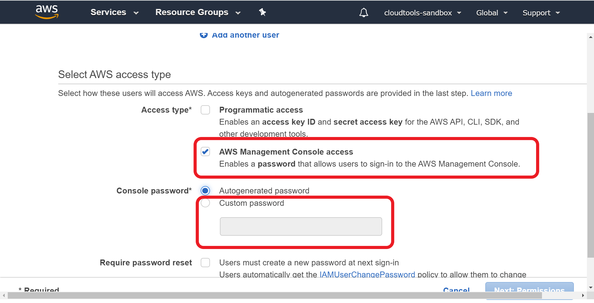
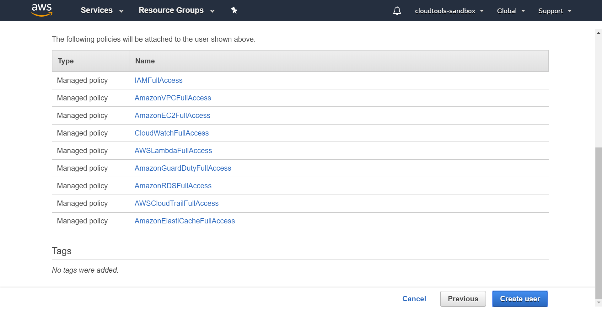
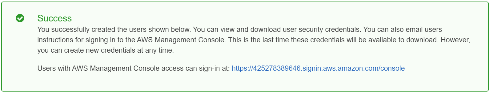
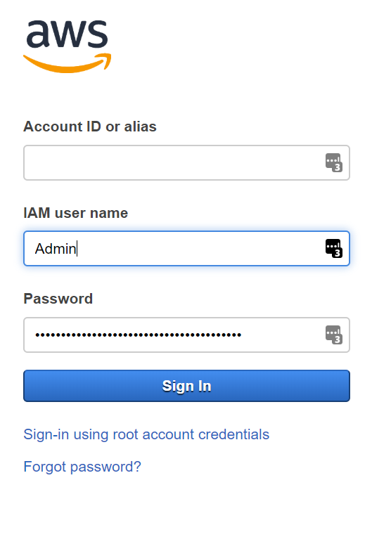
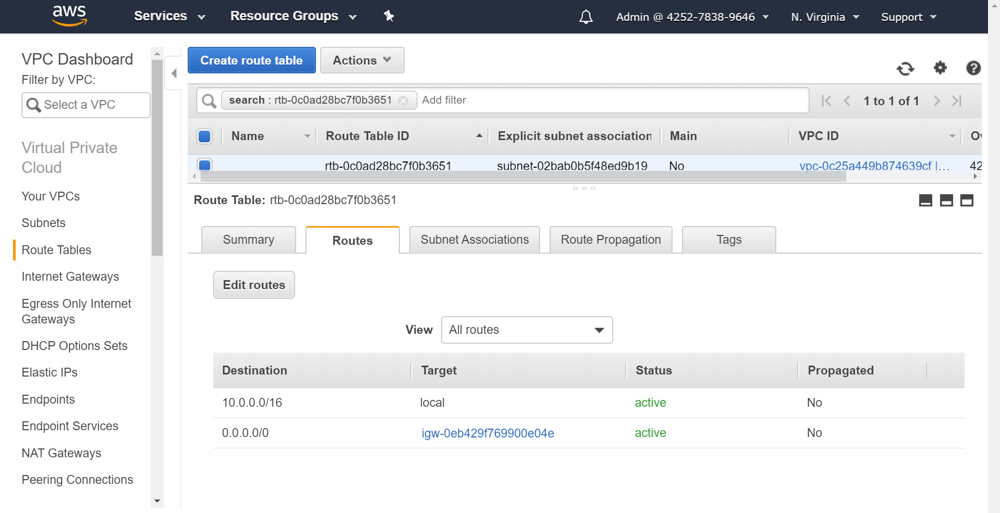

# Part 1 - Infrastructure Setup

In this step, we'll create an IAM user that only has the permissions we need for the workshop.  Then, we'll set up the VPC and access control rules, and create our EC2 instance in a public subnet and our database in a private subnet.  Once we've done all of that, we'll test the setup to make sure that everything's hooked up correctly, and that we can't access the instance from the Internet yet.

## Creating an IAM User

The principle of least privilege holds that we want people to have the exact amount of access that they need to do their jobs.  For this workshop, we're going to set up an IAM user that only has permission to use the services that we're going to work with.

1. Navigate to the IAM console, and click the 'Add user' button.

    

1. In the 'Add user' section, select 'AWS Management Console access', and 'Custom password'.  Enter a password that you'll remember - you'll be using this account for the duration of the workshop.

    

1. In the 'Permissions' section, select 'Attach existing policies directly', and then add the list of policies in the srceenshot below.  You can use the search bar to find them quickly.  Then, click through to the Review step, make sure that the list matches the one below, and click 'Create'.

    

1. Click the link shown in the Success dialog below, and use your IAM username and password to sign in.

    
    

## Setting up the VPC

Virtual Private Clouds (VPCs) allow us to isolate a group of resources from the rest of the Internet, and give us a high level of control over who accesses the resources within them.  We can split resources within a VPC into different subnets, which will allow us to make some of them Internet-accessible while hiding others.

1. Navigate to the VPC management page, and click on the 'Launch VPC Wizard' button.

    

1. Select 'VPC with a Single Public Subnet', and click through to the next step.

    

1. Set up the VPC using the settings below.

    

1. Click on the Network ACL attached to the VPC, go to the Inbound Rules tab, and click 'Edit inbound rules'.

    

1. Get your Internet connection's public IP address (`!ip` in Google will give it to you), and then replace `0.0.0.0/0` in the Source with `your.ip.address.digits/32`.  Then, do the same for the outbound rules.  This means that only people with your public IP address can access instances inside the network ACL.

    

1. Go to 'Route tables' in the VPC sidebar, and have a look at how the ingress and egress rules are configured.  We'll come back to this in Part 2.

    

1. Go to 'Subnets' in the VPC sidebar, and create a subnet using the following rules and a different availability zone from the default subnet.  We need to do this so that there are two availability zones for the RDS database.

    

## Creating the EC2 instance

1. Navigate back to the main console, and open the EC2 management page.

1. Click on 'Create instance' and select the Amazon Linux 2 AMI.

    

1. Select the VPC that you created, and then select the public subnet.

    

1. Create a public security group to attach to the instance.  You'll notice that there's a warning at the bottom of the page.  If we leave this rule like this, then anyone will be able to SSH into the instance.  Get your Internet connection's public IP address (`!ip` in Google will give it to you), and then replace `0.0.0.0/0` with `your.ip.address.digits/32`.  This means that only people with your public IP address can access the instance via SSH.

    

## Creating the database

1. Open the RDS console, and click 'Create database'.

1. Select the following options: Standard create, PostgreSQL, Free Tier.

1. Attach the database to the VPC that you created in Step 2.

    

1. Create a new private security group for the database.

    

Make sure that you save the admin username and password for the database.  We'll need these in Part 2.

To continue the lab, go to [Part 2](../Part2/README.md).

[Back to home](../README.md)