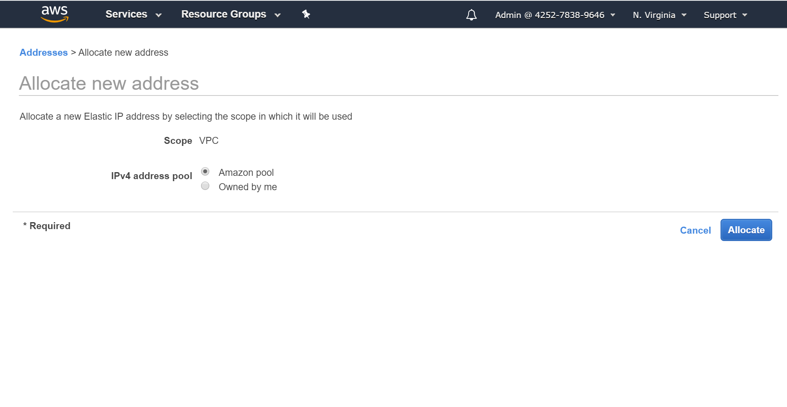
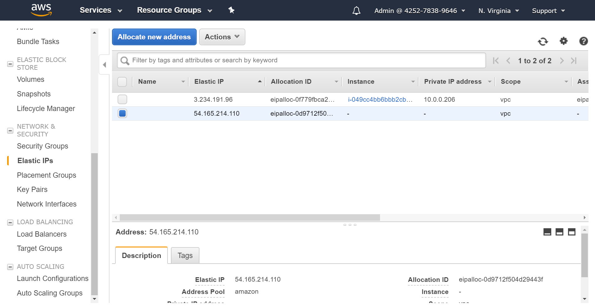
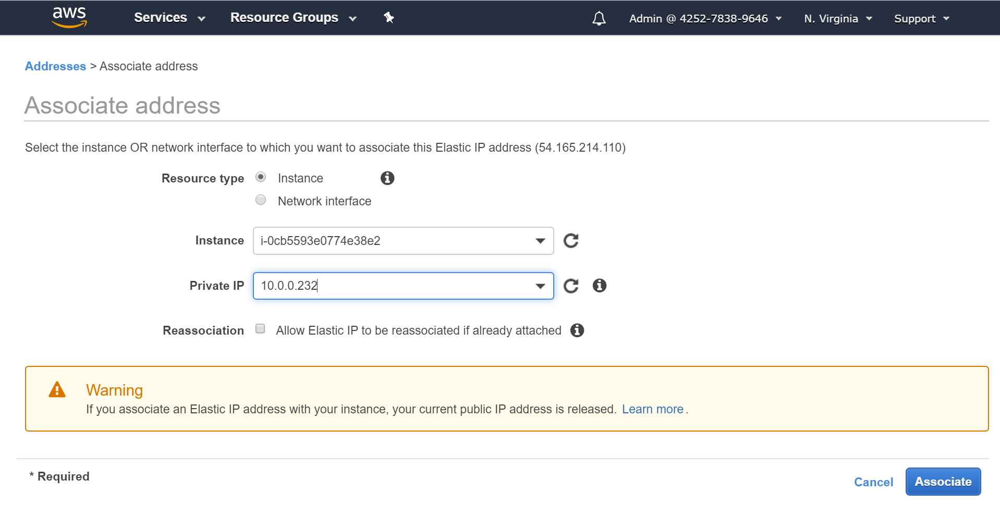
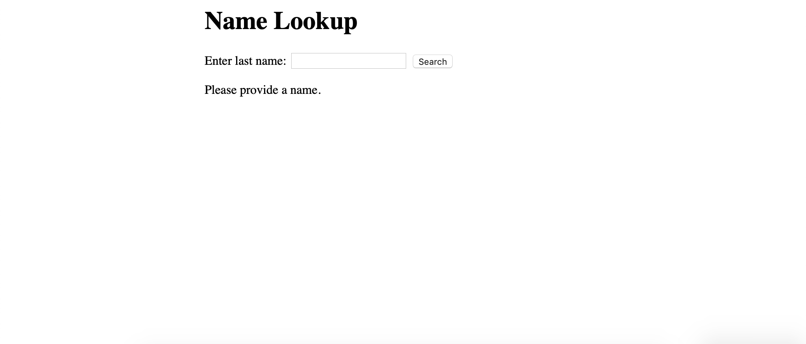

# Part 2 - Configuring Traffic Rules

In this step, we'll attach a public IP address to the EC2 instance with our website on it, and then open it up to our IP address so that we can view the website from the public Internet.

## Attaching a public IP address

In order to access our EC2 instance from the Internet, we need to add a public IP address to it so that Internet-connected machines know where to find it.

1. Go to 'Elastic IPs' in the VPC sidebar, and click on 'Allocate new address'.

    

1. Make sure you have 'Amazon pool' selected, and click on 'Allocate'.

    

1. Right-click on your new IP address, and click 'Associate address'.

    

1. Associate the Elastic IP address with your EC2 instance.

    

## Testing public access to the instance

1. SSH into your EC2 instance using the key pair from Part 1, and verify that you're able to connect to the database from it.

1. Run the following command inside the EC2 instance:

    ```
    git clone https://github.com/lisushka/secure-ec2
    ```

1. Run the following command to load data into the RDS instance:

    ```
    psql -U <database admin username> -h <RDS DNS name> -W
    ```

    The admin username was generated when you created the database in Part 1.  The RDS DNS name can be found on the RDS instance page under 'DNS name'.  The command line will prompt you for a password - this is the password that you gave when you created the database in Part 1.

1. Run the following command to start the web application:

    ```
    bundle exec ./app.rb
    ```

1. Go to the public IP address that you allocated to your instance in the previous step.  You'll notice that even though the network ACL is configured to allow traffic from your IP address, you still can't access the web application on the instance.  That's because the security group doesn't have a rule to allow HTTPS traffic.  In the next step, we'll add this rule so that we can access the EC2 instance from the Internet.

## Opening up the security group attached to the EC2 instance

1. Navigate back to the main console, and open the VPC management page.

1. Open the 'Security groups' tab in the left sidebar, and click on the security group attached to the database (`public-sg` in this example).

    

1. Click on the 'Inbound Rules' tab, and then click on 'Edit rules'.

    

1. Add rules for HTTP and HTTPS as follows.

    

You should now be able to access your EC2 instance in the browser.

## Accessing the web application in the browser

Go to the public IP address that you allocated to your instance during the `Attaching a public IP address` step.  You should see an HTML page that looks like this:



You can search the database by last name to verify that the EC2 instance is able to send and receive traffic to and from the RDS instance.

**Note:** Even if you configure network rules to open the RDS instance to the Internet, you will still not be able to access it as it is not publically accessible by default.  If you want to access an RDS instance from the Internet, you need to set the 'Publically accessible' flag in `Connectivity > Additional connectivity configuration` to Yes.  You can do this by modifying the RDS instance after creation, as well as during the creation process.

To continue on to more advanced AWS security features, go to [Part 3](../Part3/README.md).

[Back to home](../README.md)